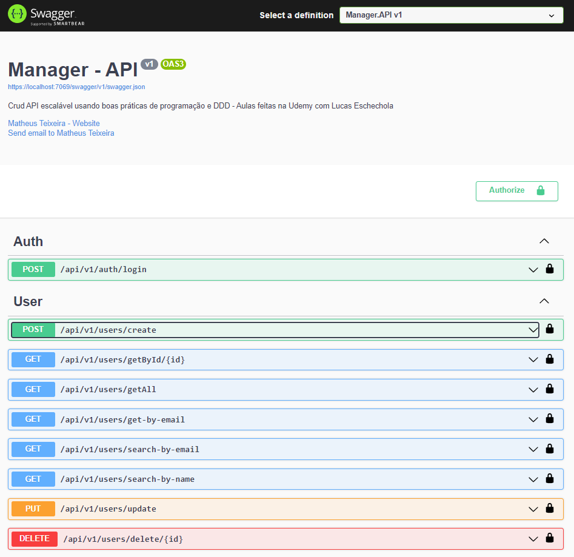

<h4>Exec on package manager console:</h4> 

*Update-Database -Project Manager.Infra -Context ManagerApiContext*  

Configure your keys on User Secrets: 

  Métodos da API: (CRUD com Token de autenticação)
  
  
